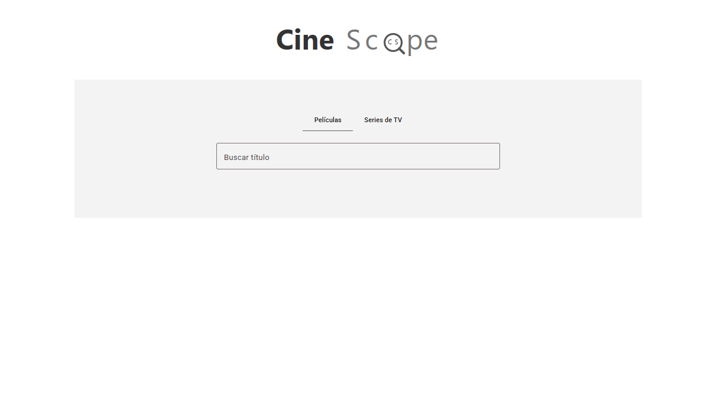
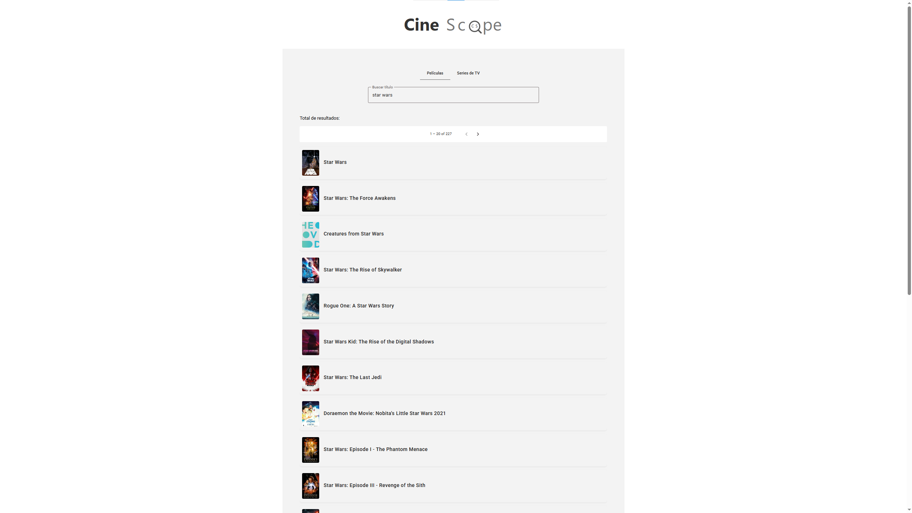
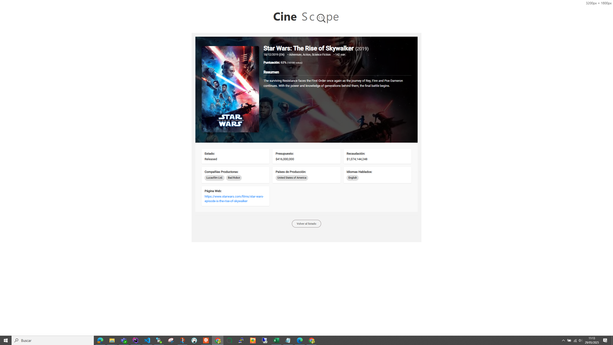
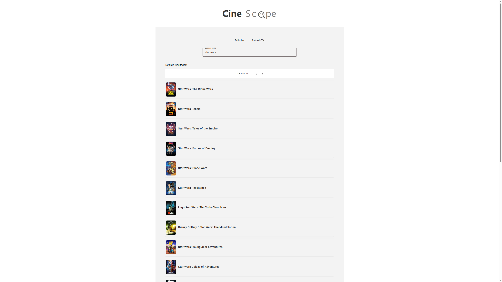
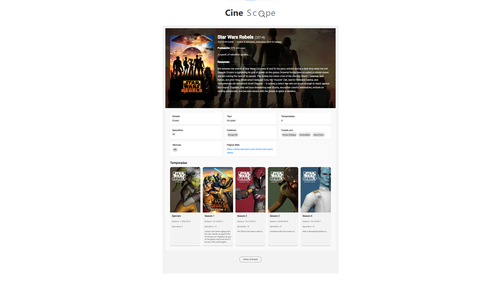

# Movies App

## Descripción del Proyecto

Esta aplicación muestra una lista de películas populares y permite a los usuarios ver detalles de cada película. Utiliza la API de [The Movie Database (TMDB)](https://www.themoviedb.org/) para obtener los datos de las películas.

## Capturas de Pantalla
### Pantalla de inicio



### Lista de Películas


### Detalles de Película


### Lista de Series


### Detalles de Serie


## Aspectos Generales

### Características Principales
*   Visualización de una lista de películas populares.
*   Visualización de detalles específicos de cada película (sinopsis, fecha de lanzamiento, calificación, póster, etc.).
*   Visualización de una lista de series populares.
*   Visualización de detalles específicos de cada serie.
*   Navegación intuitiva entre la lista y los detalles.
*   Interfaz de usuario moderna utilizando Angular Material.

### Arquitectura General
La aplicación está construida con Angular, siguiendo una arquitectura basada en componentes. Utiliza servicios para la lógica de negocio y la comunicación con APIs externas (TMDB). El enrutamiento se gestiona con Angular Router para una experiencia de navegación fluida (SPA - Single Page Application). Los estilos se manejan con SCSS y Angular Material para una interfaz de usuario consistente y atractiva.

## Aspectos Técnicos

### Tecnologías Utilizadas
*   **Framework Frontend:** [Angular](https://angular.io/) (versión específica si es relevante, ej: Angular 16+)
*   **Lenguaje:** [TypeScript](https://www.typescriptlang.org/)
*   **Gestión de Estado (si aplica):** [Ej: NgRx, Akita, o servicios de Angular]
*   **Componentes UI:** [Angular Material](https://material.angular.io/)
*   **API Externa:** [The Movie Database (TMDB) API](https://www.themoviedb.org/)
*   **Enrutamiento:** Angular Router
*   **Estilos:** SCSS, Angular Material Theming
*   **Gestor de Paquetes/Bundler:** npm, [Bun.sh](https://bun.sh/) (opcionalmente), Angular CLI
*   **Entorno de Ejecución (para desarrollo):** [Node.js](https://nodejs.org/)

### Instalación y Configuración

#### Prerrequisitos

Antes de comenzar, asegúrate de tener instalado lo siguiente:
- [Node.js](https://nodejs.org/) (que incluye npm)
- [Angular CLI](https://angular.io/cli): `npm install -g @angular/cli`

#### Pasos de Instalación

1.  **Clonar el repositorio:**
    ```bash
    git clone https://github.com/jsaiz0/movies
    cd movies
    ```
2.  **Instalar las dependencias:**
La Instalación de dependencias se ha usado Bun.sh por su eficiencia y rapidez, pero se puede utilizar igualmente npm que es el método más común.

- Método NPM
    ```bash
    npm install
    ```
 - Método BUN
    ```bash
    curl -fsSL https://bun.sh/install | bash

    bun install
    ```

3.  **Configurar la API Key de TMDB:**
    Crea un archivo `env.ts` dentro de la carpeta `src/app/env/` con el siguiente contenido, reemplazando `<TU_API_KEY_DE_TMDB>` con tu clave de API real:
    ```typescript
    // src/app/env/env.ts
    export const env = {
      // Ejemplo: production: false, (si tienes otras variables de entorno)
      apiKey: '<TU_API_KEY_DE_TMDB>'
    };
    ```
    Puedes obtener una API key registrándote en TMDB.

### Cómo Ejecutar el Proyecto

Una vez completada la instalación y configuración:

1.  **Ejecuta la aplicación en modo de desarrollo:**
    ```bash
    ng serve -o
    ```
    Navega a `http://localhost:4200/`. La aplicación se recargará automáticamente si cambias alguno de los archivos fuente.

### Estructura de Carpetas Principales
```
/src
  /app
    /components       # Componentes reutilizables o específicos de vistas
      /movie-list     # Componente para la lista de películas
      /movie-detail   # Componente para los detalles de una película
    /services         # Servicios
    /env              # Configuración de entorno (ej: env.ts para API keys)
    /models           # Interfaces y modelos de datos (ej: movie.model.ts)
    /shared           # Módulos compartidos, pipes, directivas
    app.component.ts  # Componente raíz
    app.config.ts     # Configuración principal de la aplicación (Angular 17+)
    app.routes.ts     # Definición de rutas
  /assets             # Archivos estáticos (imágenes, fuentes, etc.)
  /styles             # Estilos globales (ej: styles.scss)
  /movie-theme.scss   # Tema personalizado de Angular Material
main.ts               # Punto de entrada de la aplicación
...
```

### Componentes Clave y Flujo de Datos

La aplicación se organiza alrededor de varios componentes y servicios principales:
-   **`AppComponent`**: Es el componente raíz de la aplicación. Contiene el `<router-outlet>` donde se cargan dinámicamente los demás componentes según la ruta activa.
-   **`MovieListComponent`**: Responsable de mostrar la lista de películas (y series). Utiliza `MovieService` para obtener los datos de TMDB. Cada elemento de la lista permite navegar a la vista de detalle correspondiente.
-   **`MovieDetailComponent`**: Muestra información detallada sobre una película o serie específica. Recibe el ID del elemento a través de los parámetros de la ruta y utiliza `MovieService` para obtener los detalles completos.
-   **`MovieService`**: Encapsula toda la lógica para interactuar con la API de TMDB. Realiza las llamadas HTTP para obtener listas de películas/series y detalles específicos, utilizando la `apiKey` configurada.
-   **Enrutamiento (`app.routes.ts`)**: Angular Router gestiona la navegación. Define las rutas para la lista de películas/series y las vistas de detalle, asociando cada ruta a su componente correspondiente.
-   **Estilos (`movie-theme.scss`, `styles.scss`)**: La aplicación utiliza Angular Material para los componentes de la interfaz de usuario, con un tema personalizado para asegurar una apariencia visual coherente.

#### Flujo Básico de Usuario:
1.  El usuario accede a la aplicación, típicamente a la ruta raíz, que carga `MovieListComponent`.
2.  `MovieListComponent` invoca a `MovieService` para solicitar la lista de películas/series populares desde la API de TMDB.
3.  `MovieService` realiza la petición HTTP a TMDB y devuelve los datos.
4.  `MovieListComponent` renderiza la lista de películas/series.
5.  El usuario hace clic en una película/serie para ver sus detalles.
6.  Angular Router navega a la ruta de detalles, cargando `MovieDetailComponent` y pasando el ID del elemento como parámetro de ruta.
7.  `MovieDetailComponent` extrae el ID de los parámetros de la ruta e invoca a `MovieService` para obtener los detalles completos del elemento seleccionado.
8.  `MovieService` realiza la petición HTTP correspondiente a TMDB.
9.  `MovieDetailComponent` recibe los datos y muestra la información detallada.

### Documentación de API Externa
Este proyecto consume la [API de The Movie Database (TMDB)](https://developer.themoviedb.org/docs/getting-started). Para más información sobre los endpoints utilizados y la estructura de datos, consulta la documentación oficial de la API de TMDB.

## Pruebas

### Cómo Ejecutar las Pruebas
Para ejecutar el conjunto de pruebas unitarias y de componentes configuradas en el proyecto, utiliza el siguiente comando de Angular CLI:
```bash
ng test
```
### Tipos de Pruebas
El proyecto debería idealmente incluir los siguientes tipos de pruebas para asegurar su calidad y correcto funcionamiento:
*   **Pruebas Unitarias:** Enfocadas en verificar la lógica de los métodos individuales dentro de los servicios, componentes (clases TypeScript) y pipes.
*   **Pruebas de Componentes:** Verifican la correcta renderización, interacción y comportamiento de los componentes de Angular de forma aislada o con interacciones mínimas.

### Herramientas de Pruebas Utilizadas
*   **Pruebas Unitarias y de Componentes:** Jasmine (framework de pruebas), Karma (test runner).


